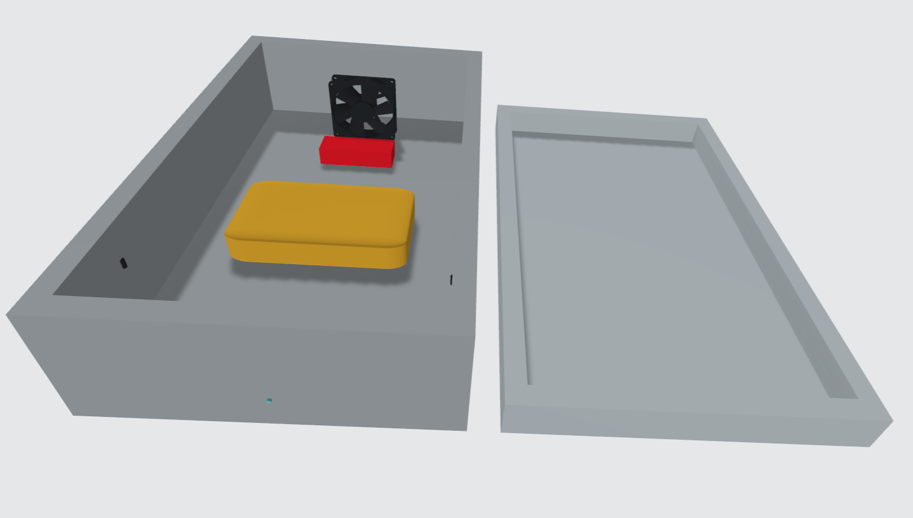
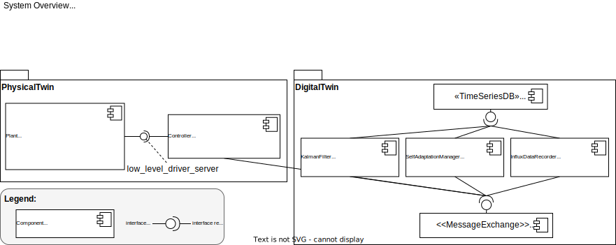
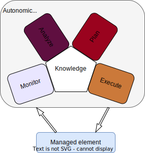
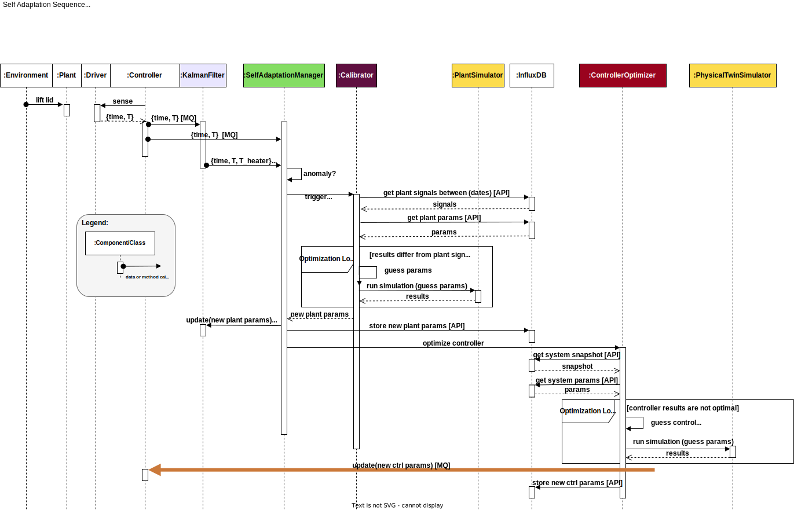
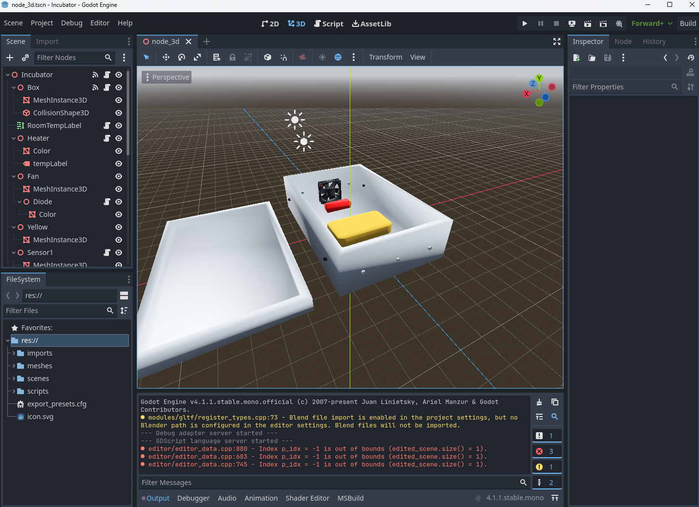
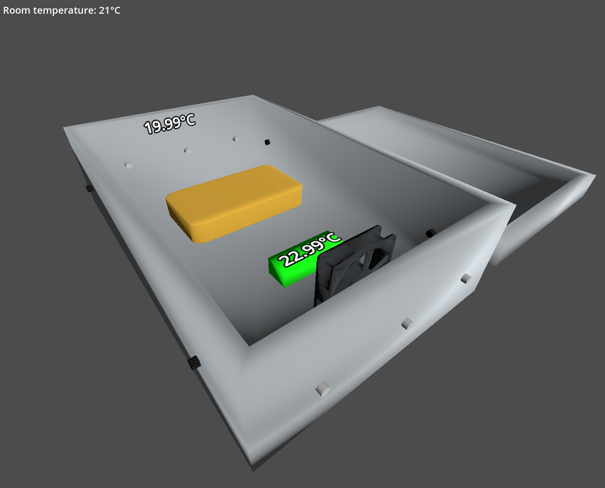

# Example Digital Twin: The Incubator

This is a case study of an Incubator with the purpose of understanding the steps and processes involved in developing a digital twin system.
This incubator is an insulated container with the ability to keep a temperature and heat, but not cool.

To understand what a digital twin is, we recommend you read/watch one or more of the following resources:
- Feng, Hao, Cláudio Gomes, Casper Thule, Kenneth Lausdahl, Alexandros Iosifidis, and Peter Gorm Larsen. “Introduction to Digital Twin Engineering.” In 2021 Annual Modeling and Simulation Conference (ANNSIM), 1–12. Fairfax, VA, USA: IEEE, 2021. https://doi.org/10.23919/ANNSIM52504.2021.9552135.
- [Claudio's presentation at Aarhus IT](https://videos.ida.dk/media/Introduction+to+Digital+Twin+Engineering+with+Cl%C3%A1udio+%C3%82ngelo+Gon%C3%A7alves+Gomes%2C+Aarhus+Universitet/1_7r1j05g8/256930613)

# Contents
- [Example Digital Twin: The Incubator](#example-digital-twin-the-incubator)
- [Contents](#contents)
- [About this Document](#about-this-document)
- [Overview of the Documentation](#overview-of-the-documentation)
  - [Searching](#searching)
- [Terminology](#terminology)
- [Our Concept of Digital Twin](#our-concept-of-digital-twin)
- [The Incubator Physical Twin](#the-incubator-physical-twin)
  - [Hardware Overview](#hardware-overview)
    - [Raspberry Pi GPIO connections](#raspberry-pi-gpio-connections)
    - [Temperature Sensor Mapping](#temperature-sensor-mapping)
    - [Connecting to the Raspberry PI](#connecting-to-the-raspberry-pi)
  - [CAD Model](#cad-model)
  - [Dynamic Models](#dynamic-models)
  - [Running The Incubator Physical Twin](#running-the-incubator-physical-twin)
- [The Digital Twin](#the-digital-twin)
  - [System Architecture](#system-architecture)
    - [Self-Adaptation](#self-adaptation)
  - [Datasets and Experiment Reports](#datasets-and-experiment-reports)
  - [Running the Digital Twin](#running-the-digital-twin)
    - [First-time Setup](#first-time-setup)
    - [After First-time Setup: Starting the DT Framework](#after-first-time-setup-starting-the-dt-framework)
    - [Running Unit Tests](#running-unit-tests)
    - [Running Integration Tests](#running-integration-tests)
- [Start visualization](#start-visualization)
- [Command Line Utilities to Interact with DT](#command-line-utilities-to-interact-with-dt)
  - [Mess With Lid Script](#mess-with-lid-script)
- [Diagnosing Startup Errors](#diagnosing-startup-errors)
  - [RabbitMQ Setup](#rabbitmq-setup)
  - [InfluxDB Setup](#influxdb-setup)
    - [First time configuration of InfluxDB server](#first-time-configuration-of-influxdb-server)
    - [Start InfluxDB server](#start-influxdb-server)
    - [Management of Influxdb](#management-of-influxdb)
    - [Initial Setup of Database](#initial-setup-of-database)
    - [Common Errors](#common-errors)
      - [Unauthorized API access](#unauthorized-api-access)
- [Repository Maintenance Instructions](#repository-maintenance-instructions)
  - [Code Organization](#code-organization)
# About this Document

**Goal:** The goal of this document is to provide users with a basic overview of the digital twin incubator and enabled them to run it on their computers.

**Audience:** This documentation is targeted at users who are acquainted with running programs from the command line and are able to install [python](https://www.python.org/) and run python scripts.

# Overview of the Documentation

The documentation is all contained into a single document for simplicity and ease of maintenance.
If the user wishes to see the documentation in some other format then we recommend cloning this repository and using [Pandoc](https://pandoc.org/) to convert the documentation into another format.

## Searching

Searching the documentation can be done by using the browser search function or using Github's search feature on top of the screen.

# Terminology

- **Plant** -- we use the term in the traditional control systems sense. The plant refers to the box contents, the heater, the sensor, and the fan. Basically it is the stuff that the controller is sensing and actuating on.
- **Controller** -- To control this responsibility is to decide when to turn on/off the heater.
- **Low Level Driver** --- This refers to the component that decouples the controller from the plant. It forms a layer that abstracts away from the details of how the actuators and sensors work and enables us to run the whole system locally on a computer without the need to connect to a real plant.

# Our Concept of Digital Twin

A digital twin is a software system that supports the operation of a cps (called the physical twin).
So the following documentation describes the physical twin first and then the digital twin.

# The Incubator Physical Twin

The overall purpose of the system is to reach a certain temperature within a box and keep the temperature regardless of content.


The system consists of:
- 1x Styrofoam box in order to have an insulated container
- 1x heat source to heat up the content within the Styrofoam box.
- 1x fan to distribute the heating within the box
- 2x temperature sensor to monitor the temperature within the box
- 1x temperature Sensor to monitor the temperature outside the box
- 1x controller to actuate the heat source and the fan and read sensory information from the temperature sensors, and communicate with the digital twin.

## Hardware Overview
Hardware Elements
- 3 temperature sensors of the type DS18S20
- 1 heat bed of the type RepRap PCB Heat bed MK2a (improved design)
  - Dimensions (Heat Bed): 200mm x 200mm
  - Resistance: 0.9 - 1.1 Ohms 
  - Operating voltage: 12 Volts
  - Operating current: 11 - 13 Amps
- 1 Fan 24V 92x25 B 87,4m³/h 34dBA - https://elektronik-lavpris.dk/files/sup2/EE92252B1-A99_D09023340G-00.pdf - https://elektronik-lavpris.dk/p122514/ee92252b1-a99-fan-24v-92x25-b-874m-h-34dba/
- Raspberry Pie starter kit
  - Raspberry Pi 4 Model B - 4 GB - https://www.raspberrypi.org/documentation/hardware/raspberrypi/bcm2711/rpi_DATA_2711_1p0_preliminary.pdf
  - 6GB Micro SD - Class A1 - Med NOOBS
  - Officiel Raspberry Pi USB-C Strømforsyning – EU – 5V 3A - Sort
  - Officiel Raspberry Pi 7" Touchscreen Display
  - SmartiPi Touch 2 - Case til Raspberry Pi 7" Touchscreen Display 
  - USB Micro SD Kortlæser
- Thermo box - Climapor thermokasse m/låg t/Eurokasse 54,5x35x18 cm
- Custom Printed Circuit Board Electronics. You can find more information [here](./software/docs/electronics/doc/doc.pdf).

### Raspberry Pi GPIO connections
- GPIO 12: PWM Heater 
- GPIO 13: PWM Fan
- GPIO 4: 1-wire temperature sensors

### Temperature Sensor Mapping
In order to read a temperature from the temperature sensors multiple IDs can be found in `/sys/bus/w1/devices/`.

If they are not visible there, check that the wires are well connected. Also check whether that the kernel submodules are active:
```bash
pi@incubatorpi:~/source/software $ lsmod | grep w1
w1_therm               28672  0
w1_gpio                16384  0
wire                   36864  2 w1_gpio,w1_therm
```

So to read a value from a sensor, one can do: `cat /sys/bus/w1/devices/10-0008039ad4ee/w1_slave`.

The sensors were connected according to [this online guide](https://www.circuitbasics.com/raspberry-pi-ds18b20-temperature-sensor-tutorial/).

Each ID in the `/sys/bus/w1/devices` folder correspond to a particular sensor. Follow the wires of the temperature sensors, and you will find a paper label with a number on it.
The ID to number mapping is:

ID to Sensor Number Mapping:

| ID              | Sensor Number |
|-----------------|:-------------:|
| 10-0008039ad4ee |       1       |
| 10-0008039b25c1 |       2       |
| 10-0008039a977a |       3       |

### Connecting to the Raspberry PI

Easiest way to connect is to use VNC Viewer, as the pi runs a VNC server.
Contact [claudio](mailto:claudio.gomes@ece.au.dk) for help in this step.

Alternatively, it is possible to connect to the raspberry pi via a local network: the Pi outputs a Wifi network with the name incubator. 
The password is located physically on the Pi.

Once connected, one can SSH to the PI. The username and password is also physically located on the Pi.


## CAD Model

A .obj file is available at: [figures/incubator_plant.obj](figures/incubator_plant.obj).



Ongoing development of the cad model is at 
[incubator](https://www.tinkercad.com/things/ls1YolyX1fc-incubatorv20230429)

## Dynamic Models

Most models are implemented using the [oomodellingpython](https://gitlab.au.dk/clagms/oomodellingpython/) package.

Models can be organized as plant models, [controller models](software/incubator/models/controller_models), or physical twin models (the later couple plant and controller together):
- Controller Models: we have implemented multiple controller models but only document the following:
  - [controller_model4](software/incubator/models/controller_models/controller_model4.py) -- This is like a [bang bang controller](https://en.wikipedia.org/wiki/Bang%E2%80%93bang_control) which tries to keep the temperature within an upper and lower bound.
- Plant Models: we have implemented multiple plant models but document the following:
  - [four_parameter_model](software/incubator/models/plant_models/four_parameters_model/four_parameter_model.py) --- this model represents the average temperature dynamics inside the box considering both the heater and the air as heat accumulating entities.
- [Physical Twin Models](software/incubator/models/physical_twin_models):
  -  [system_model4](software/incubator/models/physical_twin_models/system_model4.py) --- this model couples the controller_model4 model and the four_parameter_model.

## Running The Incubator Physical Twin

On the raspberry pi: 
1. Start the [low_level_driver_server.py](software/incubator/physical_twin/low_level_driver_server.py)
   ```powershell 
   PS software> python -m incubator.physical_twin.low_level_driver_server
   ```
2. Start the controller you wish to use. For example the [start_controller_physical.py](software/startup/start_controller_physical.py) is:
   ```powershell 
   PS software> python -m startup.start_controller_physical
   ```

# The Digital Twin

The DT follows a service based architecture, with different services communicating with each other via a [RabbitMQ message exchange](https://www.rabbitmq.com/) running on a [docker](https://www.docker.com/products/docker-desktop) container.
Each service is started with a python script, and most services refer to [software/startup.conf](software/startup.conf) for their configuration.

The code that starts the services is in [software/startup](software/startup).
It is possible to start all services (except the 3D visualization service) from the same script [software/startup/start_all_services.py](software/startup/start_all_services.py) or each service individually.

The services (and their starting scripts) currently implemented are:
- [incubator_realtime_mockup](software/startup/start_incubator_realtime_mockup.py) -- implements a real time plant simulation mockup so that the whole digital twin system can be run locally on any computer without the need to connect to an external physical twin. When using a real physical twin this service is not started.
- [low_level_driver_mockup](software/startup/start_low_level_driver_mockup.py) -- This instantiates a low level driver service that is wired to work with a real time plant simulator mockup. When using a real physical twin this service is not started.
- [influx_data_recorder](software/startup/start_influx_data_recorder.py) -- the service listens to a particular topic from RabbitMQ records the messages into the time series database [InfluxDB](https://portal.influxdata.com/downloads/)
- [plant_kalmanfilter](software/startup/start_plant_kalmanfilter.py) -- This service estimates the full state of the system and is used as a basis for anomaly detection.
- [plant_simulator](software/startup/start_plant_simulator.py) -- The service can run simulations based on the data from the time series database with different conditions for the plant model.
- [simulator](software/startup/start_simulator.py) -- This service can run simulations of the controller and plant system from data based on the data from the time series databases with different conditions.
- [calibrator](software/startup/start_calibrator.py) -- The service can use data from the time series database to estimate the parameters of the plant model.
- [controller_physical](software/startup/start_controller_physical.py) -- this service implements the controller.
- [supervisor](software/startup/start_supervisor.py) -- This service can periodically retune the controller.
- [self_adaptation_manager](software/startup/start_self_adaptation_manager.py) -- the service implements the self-adaptation which checks whether the physical characteristics of the plant have changed and can trigger a recalibration as well as controller tuning when that happens.
- [3d_visualization](software/digital_twin/visualization/project.godot) -- This service is a [Godot](https://godotengine.org/) project that shows a 3D rendering of the incubator. 
- [energy_saver](software/startup/start_energy_saver.py) -- This service is a simplified version of [self_adaptation_manager](software/startup/start_self_adaptation_manager.py) that reconfigures the controller to a lower energy consumption configuration when the lid is open.

## System Architecture

We use the [C4 Model](https://c4model.com/) to document the software architecture.



All communication goes through the RabbitMQ server, even the communication between the Controller and Plant.
The Controller communicates with the Plant by listening and sending RabbitMQ messages to the [low_level_driver_server.py](./software/incubator/physical_twin/low_level_driver_server.py).

Anyone else interested in this communication, such as the digital twin, can listen to it as well.

### Self-Adaptation

The most complex behavior is the self-adaptation, as it involves most implemented DT components.

This is introduced in the following paper, which we recommend you read:
- Feng, Hao, Cláudio Gomes, Santiago Gil, Peter H. Mikkelsen, Daniella Tola, Peter Gorm Larsen, and Michael Sandberg. “Integration Of The Mape-K Loop In Digital Twins.” In 2022 Annual Modeling and Simulation Conference (ANNSIM), 102–13. San Diego, CA, USA: IEEE, 2022. https://doi.org/10.23919/ANNSIM55834.2022.9859489.
- *Note that diagrams in the paper are likely outdated. Updated diagrams are shown below*

The main components and their dependencies are:



Legend:
- [MQ] - Communication happens via RabbitMQ messages.
- [API] - Communication happens via method call.

The following shows the main stages involved in a self-adaptation:



In particular, these are followed by the SelfAdaptationManager:


The following diagram shows the main interactions between the main entities that participate in the self-adaptation process. It is assumed that an anomaly has occurred due to the lid being open.



## Datasets and Experiment Reports

See [incubator/datasets](./software/incubator/datasets/README.md)

## Running the Digital Twin

It is possible to run the digital twin on our computer, with or without a connection to the physical twin.

*You're advised to read carefully all documentation before acting on any instruction.*

### First-time Setup
1. Open terminal in [software](software).
2. (Optional) Create a virtual environment: `python -m venv venv`
3. (Optional) Activate the virtual environment (there are multiple possible activate scripts. Pick the one for your terminal.): 
   1. Windows Powershell:`.\venv\Scripts\Activate.ps1` 
   2. Linux/Mac: `source venv/bin/activate`
4. (Optional) Install pip wheel: `pip install wheel`
5. Install dependencies:
   1. `pip install -r ./requirements.txt`
6. Install [docker](https://www.docker.com/products/docker-desktop) installed (see [Docker Homepage](https://docs.docker.com/desktop/))
7. (Optional) Install [Godot](https://godotengine.org/download/windows/) in case you want to load 3D visualization, only works on Windows. 


### After First-time Setup: Starting the DT Framework

1. Inspect the [startup.conf](./software/startup.conf) in this folder. You should not need to change anything for running the DT locally.
2. Make sure docker is running. 
3. Run
   ```bash
   software$ python -m startup.start_all_services
   ```
4. After starting all services successfully, the controller service will start producing output that looks like the following:
   ````
   time           execution_interval  elapsed  heater_on  fan_on   room   box_air_temperature  state 
   19/11 16:17:59  3.00                0.01     True       False   10.70  19.68                Heating
   19/11 16:18:02  3.00                0.03     True       True    10.70  19.57                Heating
   19/11 16:18:05  3.00                0.01     True       True    10.70  19.57                Heating
   19/11 16:18:08  3.00                0.01     True       True    10.69  19.47                Heating
   19/11 16:18:11  3.00                0.01     True       True    10.69  19.41                Heating
   ````
5. Login to http://localhost:8086/ (or more generally http://[Influxdb_IP]:8086/) to see the influxdb management page, were you can create dashboards to see the data produced by the incubator. The login details are:
   - user=`incubator`
   - password=`incubator`
6. Login http://localhost:15672/ to see the RabbitMQ management page. The login details are:
   - user=`incubator`
   - password=`incubator`
7. Optional: [Start visualization](#start-visualization)
8. See [Diagnosing Startup Errors](#diagnosing-startup-errors) in case you encounter problems
9. Recommended: [Run the unit tests](#running-unit-tests)
10. Recommended: [Run the integration tests](#running-integration-tests)

### Running Unit Tests

Make sure you can successfully [start the DT framework](#after-first-time-setup-starting-the-dt-framework)

To run the unit tests, open a terminal in [software](software), and
1. Activate virtual environment
2. If using powershell, run [./run_tests.ps1](./software/run_tests.ps1)
3. Otherwise:
   1. Set environment variable `CLIMODE = "ON"`
   2. Run tests: `python -m unittest discover -v incubator/tests -p "*.py"`

### Running Integration Tests

Make sure you can successfully [start the DT framework](#after-first-time-setup-starting-the-dt-framework) and [run the unit tests](#running-unit-tests) before attempting to run the integration tests.

The script [run_integration_tests.ps1](./software/run_integration_tests.ps1) contains the instructions.

# Start visualization

We assume the reader is broadly familiar with [Godot](https://godotengine.org/) engine.

1. Download and install Godot v4.1.1.stable.mono.official [bd6af8e0e]
2. Open [project.godot](software/digital_twin/visualization/project.godot) with Godot engine.
3. The UI should look like:
   
4. Make sure the RabbitMQ server is runnning.
5. Build and run the project by clicking on the "play" button in the top-right corner (or press F5). If the application crashes when opening the project, it could be due to:
   1. Connection from Godot to Rabbitmq server failed (check the Errors tab in Godot UI).
   2. You GPU does not support the Vulkan rendering API. Open a terminal and run the following command: 
   ```
   C:\path\to\your\godot4.exe --rendering-driver opengl3.
   ```
6. The result should look like this:
   

# Command Line Utilities to Interact with DT
The Incubator contains several scripts for interacting with the DT as it is running live. The scripts can be found in [software/cli](software/cli).
The scripts can be executed by following the pattern: `python -m cli.<script_name>`.<br>
For instance, to generate dummy data the following script can be executed: `python -m cli.generate_dummy_data`. Notice that some scripts require extra parameters.

## Mess With Lid Script
Certain configurations of the Incubator support anomaly detection to determine if the styrofoam lid has been removed from the box.<br>
When running a mocked version of the PT, the behavior of removing the lid can be simulated through the [software/cli/mess_with_lid_mock.py](software/cli/mess_with_lid_mock.py) script.<br>
In practice, the simulation is accomplished by changing the $G_{box}$ parameter of the mocked PT. The $G_{box}$ represents the rate of energy transfer between the air inside the box and the air outside the box.

**Executing the script:**<br>
The script can be executed by running `python -m cli.mess_with_lid_moc <N>`, where $N$ represents a positive integer to multiply the original $G_{box}$ with.<br>
For instance, the `python -m cli.mess_with_lid_moc 100` simulates a greater loss of energy to the outside (lid off) and `python -m cli.mess_with_lid_moc 1` simulates the original behavior (lid on).

# Diagnosing Startup Errors

If any errors show up during the startup process, check that the RabbitMQ server and InfluxDB are being correctly started. 

The following instructions were used to configure these services in the first time and may help you test them:

## RabbitMQ Setup

To start the RabbitMQ server, run the following in [software/incubator/communication/installation](software/incubator/communication/installation):
``` Powershell
# start and install rabbitmq container
PS software\incubator\communication\installation> docker-compose up --detach --build
[MACOS: docker compose up --detach --build]

# Check logs of rabbitmq-server
PS software\incubator\communication\installation> docker logs rabbitmq-server

# Run script to test server (assumes you have correct environment)
cd [RepoRoot]\software\
[Activate virtual environment]
PS software> python -m incubator.communication.installation.test_server

# Stop and remove the server
PS software> docker-compose down -v
[MACOS: docker compose down -v]
```

The script should produce:
```
Sending message...
Message sent.
Retrieving message. Received message is {'text': '321'}
```

More information about the [Dockerfile](software/incubator/communication/installation/Dockerfile):
https://hub.docker.com/_/rabbitmq

Management of local RabbitMQ:
1. Start RabbitMQ server
2. Open http://localhost:15672/ on your browser.
3. User and pass configuration are stored in [rabbitmq.conf](software/incubator/communication/installation/rabbitmq.conf) and passed to the container through the [Dockerfile](software/incubator/communication/installation/Dockerfile)

## InfluxDB Setup

### First time configuration of InfluxDB server

Run the following if this is the first time you're starting the InfluxDB server:
1. Unzip [influxdb.zip](./software/digital_twin/data_access/influxdbserver/influxdb.zip) into a new directory called [influxdb](./software/digital_twin/data_access/influxdbserver/influxdb).
   The directory tree should look like: 
   ```powershell
   influxdb
   │   config.yaml
   │   docker-compose.yml
   │   Dockerfile
   │   influxdb.zip
   │   README.md
   │   test_server.py
   └── influxdb
       │   influxd.bolt
       └── engine
           │   data
           └── wal
   ```
2. This directory tree will contain all the data stored in InfluxDB, even if the virtual machine is deleted. So you can back it up if you want to protect the data.
3. [Start the InfluxDB server](#start-influxdb-server).

### Start InfluxDB server

To start the InfluxDB server, run from the [influxdbserver](software/digital_twin/data_access/influxdbserver) folder:
1. Start InfluxDB:
   ```Powershell
   PS software\digital_twin\data_access\influxdbserver> docker-compose up --detach --build
   ```
2. Run script to test connection to InfluxDB
   ```Powershell
   PS software\digital_twin\data_access\influxdbserver> cd [RepoRoot]\software
   [Activate virtual environment]
   PS software> python -m digital_twin.data_access.influxdbserver.test_server
   ```
3. See the data produced by the script by logging in to http://localhost:8086/ (user and password below) and opening the test dashboard.
4. Stop and remove the server:
   ```Powershell
   docker-compose down -v
   ```

More information: https://docs.influxdata.com/influxdb/v2.0/get-started/

### Management of Influxdb

1. Start InfluxDB server
2. Open http://localhost:8086/ on your browser.
3. Alternative, open a terminal in the container: `docker exec -it influxdb-server /bin/bash`

### Initial Setup of Database

This has been done once, and there's no need to repeat it.
But it is left here in case we lose the file [influxdb.zip](./software/digital_twin/data_access/influxdbserver/influxdb.zip).

1. Open http://localhost:8086/
2. Press Get-Started
3. Enter information:
    ```
    user: incubator
    pass: incubator
    organization: incubator
    bucket: incubator 
    ```
4. Run the [test_server.py](software/digital_twin/data_access/influxdbserver/test_server.py) script to start pushing random data onto the db.
5. Create dashboards by importing the json files in [dashboards](software/digital_twin/data_access/influxdbserver/dashboards) in the management page.

### Common Errors

#### Unauthorized API access

If while running `test_server` in [Start influxdb server](#start-influxdb-server), you get an error resembling the following:
```
> write_api.write(bucket, org, point)
(Pdb) config["influxdb"]
ConfigTree([('url', 'http://localhost:8086'), ('token', '-g7q1xIvZqY8BA82zC7uMmJS1zeTj61SQjDCY40DkY6IpPBpvna2YoQPdSeENiekgVLMd91xA95smSkhhbtO7Q=='), ('org', 'incubator'), ('bucket', 'incubator')])
influxdb_client.rest.ApiException: (401)
Reason: Unauthorized
HTTP response headers: HTTPHeaderDict({'Content-Type': 'application/json; charset=utf-8', 'X-Platform-Error-Code': 'unauthorized', 'Date': 'Wed, 31 Aug 2022 09:35:17 GMT', 'Content-Length': '55'})
HTTP response body: {"code":"unauthorized","message":"unauthorized access"}
-> write_api.write(bucket, org, point)
```

Then the cause is the token used in the [startup.conf](software/startup.conf) needs to be updated.
To fix open the InfluxDB web management page, go to InfluxDB->Tokens and generate a new token. Then update [startup.conf](software/startup.conf) with the new token.

Original issue described in [#23](https://github.com/INTO-CPS-Association/example_digital-twin_incubator/issues/23).


# Repository Maintenance Instructions

We make extensive use of README.md files. Please read them and keep them up to date.

General guidelines:
1. Run the tests as often as possible.
2. Create tests as much as possible. If the tests are long running, such as calibrations and optimizations, create a version of the test that runs faster (e.g., on a subset of data) when running the tests from the command line. See [example_test.py](./software/incubator/tests/example_test.py).
3. Create code that is testable.
4. Ask for code reviews (code readable by at least two people is more likely readable by a third)
5. Organize and document datasets and experiments.
6. Beware of large datasets. Host them elsewhere if needed, but include a short version of the dataset in the repository.
7. Don't be afraid of reorganizing the code and repo if you think that's necessary. This is an ongoing learning process for everyone. Discuss with Casper, Kenneth, or Claudio before doing so if you're not sure.
8. We shy away from branches except when they add a substantial amount of functionality. 
9. Commit and push responsibly to the main branch, that is, always make sure that:
   1. That all tests pass (unit tests and integration tests).
   2. That new code is documented and tested.
   3. That documentation links are not broken. 
      1. Use for example, [markdown-link-check](https://github.com/tcort/markdown-link-check) to check all md files for broken links:
         ```powershell
         Get-ChildItem -Include *.md -Recurse | Foreach {markdown-link-check --config .\markdown_link_check_config.json $_.fullname}
         ```
      2. If relevant, regenerate the [Table of Contents](#contents), either by hand or (recommended) using [Markdown All in One](https://marketplace.visualstudio.com/items?itemName=yzhang.markdown-all-in-one) or some other utility.
10. Much more on https://github.com/HugoMatilla/The-Pragmatic-Programmer

## Code Organization

The [software](software) directory contains all things code related.
- [cli](./software/cli) -- Contains code to communicate with the running DT components.
- [digital_twin](./software/digital_twin) -- Code that forms the digital twin services.
- [incubator](./software/incubator) -- Code that implements the physical twin, models, and datasets
- [integration_tests](./software/integration_tests) -- Code to run integration tests.
- [mock_plant](./software/mock_plant) -- Code setting up the local virtual incubator plant.
- [startup](./software/startup) -- Code to start and stop the DT services.
