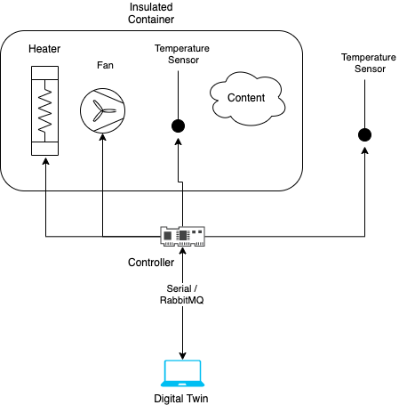

Much information is currently captured in issues. Please consult the issues for information.

# The Incubator Digital Twin

This is a case study of an Incubator with the purpose of understanding the steps and processes involved in developing a digital twin system.
An incubator, or heater, is an insulated container with the ability to keep a temperature and heat, but not cool.

The main novelty potential is the ability to answer what-if questions, which is somewhat general for digital twins.
The controller does not need any sophisticated model to work, but any other questions regarding the future behaviour of a system with possibly open loop control, will require a somewhat good model of what’s actually happening inside the box at the time the questions are asked.

Furthermore, the hope is that the approach used / created during this case study can be reused for the next case study (i.e. robotti/arm/water) and thereby validated/adjusted.

## The System
The overall purpose of the system is to reach a certain temperature within a box and keep the temperature regardless of content.

The system consists of:

- A Styrofoam box in order to have an insulated container.

- A heat source to heat up the content within the Styrofoam box.

- A fan to distribute the heating within the box

- A temperature sensor to monitor the temperature within the box

- A temperature Sensor to monitor the temperature outside the box

- A controller to communicate with the digital twin, actuate the heat source and the fan and read sensory information from the temperature sensors.

## The Digital Twin Framework
1. Continuously monitor the assumptions made about the system and its model. This is essential for safety and a pre-condition to everything else. For instance: the uniform temperature assumption should hold whenever the fan is operating and the heating is turned off. This is a basic assumption that we make when answering what if questions. If that does not hold, it might mean the fan has stopped working.

2. Continuously compare the system behavior with the predictions of the models. E.g., when the heating element is turned on for 5 seconds, the temperature should reach 35 degrees within the next 30 seconds and then slowly go down to 25 degrees within 5 minutes.

3. Re-calibrate when 2 no longer holds (in this case, finds the new parameter for the element being warmed inside, for example, a glass of water).

4. Possibly re-tunes the controller to optimize the behavior under the newly calibrated model. E.g., instead of turning the heating element for 5 seconds, it now only turns it for 3 seconds, to reach the same 35 degrees within the next 30 seconds.

5. Answers what-if questions: Suppose you want to turn off the heating element for some hours (maybe due to power loss or some other intervention). Is there anything that you can do to keep the temperature inside the box within range? Maybe place a bottle of hot water? If so, how warm must the water be?

## Drawbacks
1. Maybe not very exciting (I personally would like to play with a robot manipulator or a robot...).
2. Experiments take longer to complete (depending on the size, and if outside temperature is to be taken into account, an experiment may take days).
3. Safety (heating elements can ignite something if we’re dealing with high temperatures...). Here you guys may know better but I guess working with 12V heating elements should be less of a safety issue.
4. ?

## Interesting Modelling Challenges
- Optimality of system design: where to place sensors/actuators? How to ensure uniform temperature distributions inside the box (this question is also really important for the lumped parameter modelling of this system)?

- Need for “on-the-fly” calibration: what you place inside the box (e.g., eggs, or a bottle of water) may have wildly different thermal properties, making any model previously calibrated invalid. Moreover, some stuff actual undergoes transformations that changes them from heat sink to heat source (e.g., fermented stuff called tempeh tends to start producing heat after the fungus develop).

- Need to answer “what-if” questions: suppose you want turn off the heating element for some hours (maybe due to power loss or some other intervention). Is there anything that you can do to keep the temperature inside the box within range? Maybe place a bottle of hot water? If so, how warm must the water be?

## Hardware Equipment
**An issue is created on each piece of hardware!!!**
- Heater: https://www.amazon.com/Fdit-Constant-Temperature-Heating-Element/dp/B07B26KKH7/ref=sr_1_10?dchild=1&keywords=12v+heating+element&qid=1597655263&sr=8-10
https://www.aliexpress.com/item/32997813152.html?spm=2114.search0302.3.17.7656418cbXZztz&ws_ab_test=searchweb0_0,searchweb201602_0,searchweb201603_0,ppcSwitch_0&algo_pvid=6afeafe2-eb67-4473-93ee-cbe1065571b7&algo_expid=6afeafe2-eb67-4473-93ee-cbe1065571b7-2
- Fan: https://www.amazon.com/Fdit-Constant-Temperature-Heating-Element/dp/B07B26KKH7/ref=sr_1_10?dchild=1&keywords=12v+heating+element&qid=1597655263&sr=8-10
https://www.aliexpress.com/item/4000848132589.html?spm=a2g0o.productlist.0.0.885f7442oFm8UR&algo_pvid=7cfddd05-26ec-4d3c-9e05-a7a9bb0a0fcd&algo_expid=7cfddd05-26ec-4d3c-9e05-a7a9bb0a0fcd-1&btsid=0ab6f81615976634158253060e6690&ws_ab_test=searchweb0_0,searchweb201602_,searchweb201603_
- Tempearture Sensor: https://let-elektronik.dk/shop/1350-temperatur/245-one-wire-digital-temperature-sensor---ds18b20/ precise enough? -+ 0.5 C
- Controller: Raspberry Pie? 
- Styrofoam box: https://www.bauhaus.dk/opbevaringskasse-med-lag-50-l-59-5-x-39-5-cm

Heater and fan are currently the same, but it would be good to separate them. Any inputs are very welcome!

## Software
- Microcontroller programming
- Microcontroller FMU/RabbitMQ FMU
- Monitoring FMU
- Models of the Physical System (Fan, Heater, Temperature Sensor, one or more FMUs?)
- Maestro 

# Repository Maintenance Instructions

General guidelines (instructions are in the following subsections)

1. Run the tests as often as possible.
2. Create tests as much as possible.
3. Ask for code reviews (code readable by at least two people is much more likely readable by a third)
4. Organize and document your datasets, and experiments: use the sphinx documents for this.
5. Beware of large datasets.
6. Don't be afraid of reorganizing the code and repo if you think that's necessary. This is an ongoing learning process for everything. Discuss with Casper, Kenneth, or Claudio before doing so.

## Running Tests

## Creating Tests

## Large Datasets

## Generate the Docs