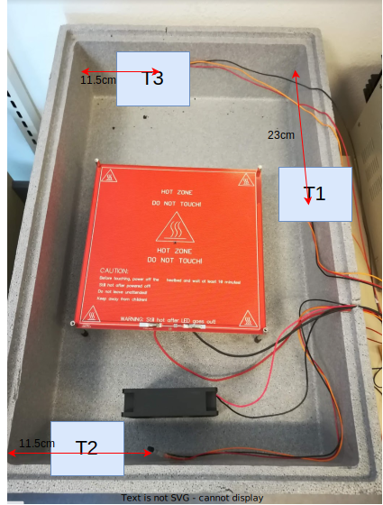
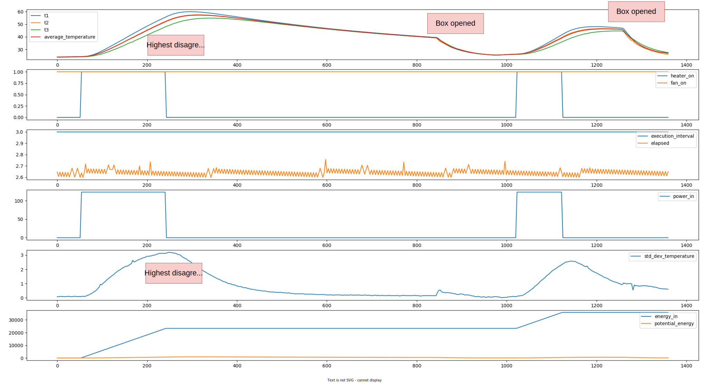
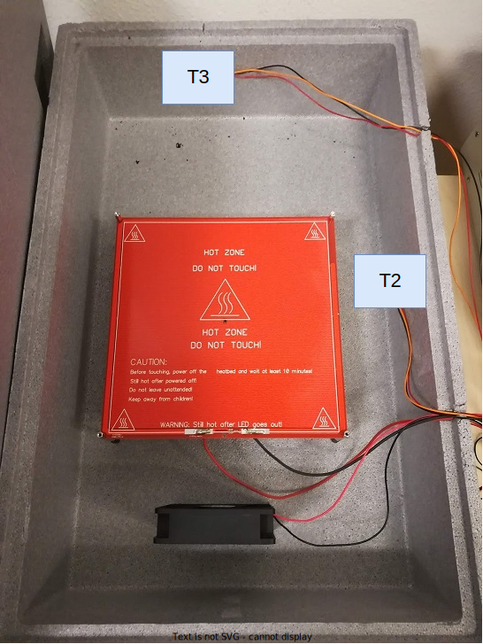
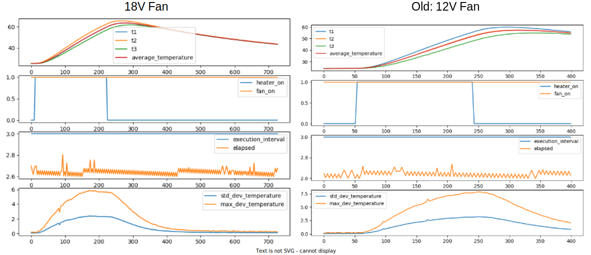

# Experiment 

## Goal 

Understand how uniform the temperature inside the box is.

## Author

Claudio

## Configuration

### Hardware

2 experiments where conducted. One with a 12V fan, and another one with an 18V fan.

### Software 

The software controller just produces a step function.

## Experiment Log and CSVs

- [uniform_temperature.csv](uniform_temperature.csv): the dataset with the less powerful fan.
- [uniform_temperature_better_fan.csv](uniform_temperature_better_fan.csv): the dataset with the more powerful fan.

## Results and Discussion

## 12V Fan

From the above, it seems that the temperature correlates with the distance to the heatbed. 
So the best setup is to place a sensor in the hottest position, one in the coldest position, and then take the average of those two.
The hottest position is T1, and the coldest is T3.

As a result, the new setup is as follows:

## 18V Fan

The 12V fan setup showed a discrepancy of a maximum of 7 degrees between the three temperature measurements.
So we increased the voltage of the fan to 18V.
The results are a bit better now.

