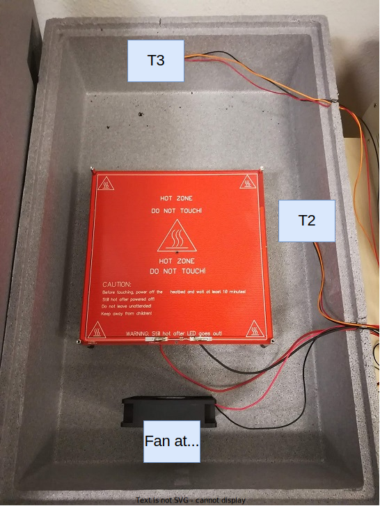
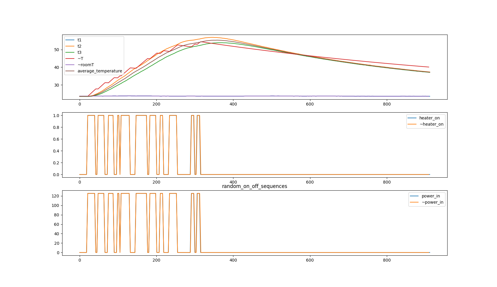

# Experiment with different control parameters

## Goal 

Compare the 2 parameter model with a real experiment.

## Author

Hao

## Configuration

### Hardware



### Software 

The controller used just produces random input sequences.

## Experiment Log and CSVs

- [random_on_off_sequences.csv](random_on_off_sequences.csv): Main dataset, trimmed to our needs.
- [random_on_off_sequences_1.csv](random_on_off_sequences_1.csv): Extended dataset
- [random_on_off_sequences_2.csv](random_on_off_sequences_2.csv): Extended dataset

## Results and Discussion

The 2 parameter model was used with the following parameters:
```python
two_param_model_params = [
    616.56464029,   # C_air
    0.65001889      # G_box
]
```

The results look like:



As can be seen the model is not bad.
