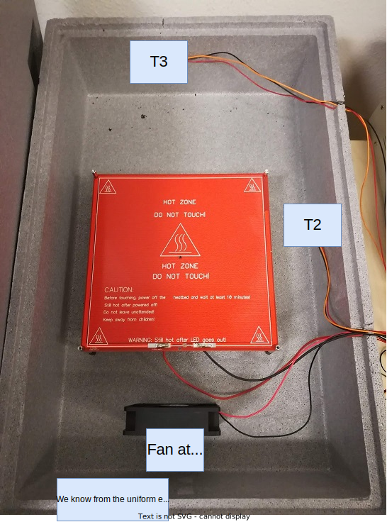
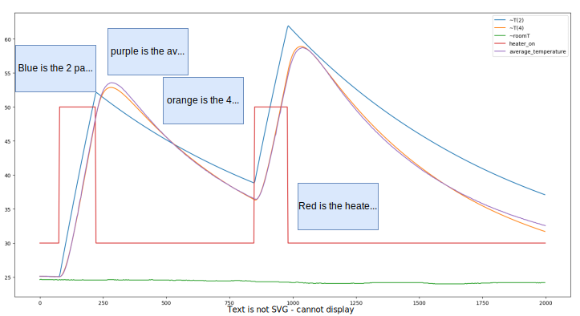

# Experiment with different control parameters

## Goal 

Calibration and 2 and 4 parameter model.

## Author

Hao

## Configuration

### Hardware

### Software 

The controller used just produces semi-random input sequences.

## Experiment Log and CSVs

- [semi_random_movement.csv](semi_random_movement.csv): Main dataset, trimmed to our needs.

## Results and Discussion

We used two models: one model with two parameters (TwoParameterModel) and another model with four parameters (Four Parameter Model).

The former predicts only the heat capacity of the incubator, whereas the second takes into account the heat capacity of the heater itself as well.

The two parameter model is good to get a rough approximation of the system magnitude and time scale, whereas the four parameter model is pretty good at predicting the inertia of the heater itself.
