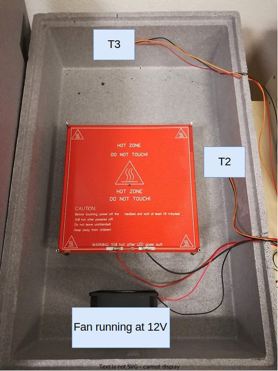

# Experiment 

## Goal 

Understand how different control parameters affect the system.

## Author

Hao

## Configuration

### Hardware

### Software 

The desired temperature was set to 35 (corresponding the UL). And the LL is 30.
Each csv has a different control configuration.

## Experiment Log and CSVs

- [exp1_ht3_hg2.csv](exp1_ht3_hg2.csv): Heating time is 3 seconds, and heating gap is 2.
- [exp2_ht20_hg30.csv](exp2_ht20_hg30.csv): Heating time is 30 seconds, and heating gap is 20.

## Results and Discussion

The best configuration found is Heating time 30 seconds, and heating gap 20.
