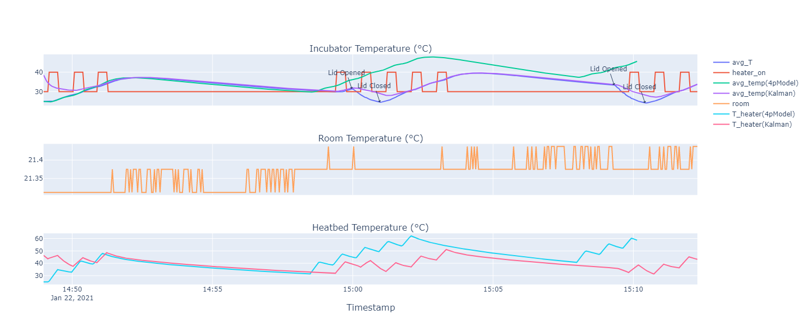

# Experiment 

## Goal 

Illustrate the effect of opening the lid and test the Kalman filter.

## Author

Hao

## Configuration

### Hardware


### Software 

## Experiment Log and CSVs

- [lid_opening_experiment_jan_2021.csv](lid_opening_experiment_jan_2021.csv): the dataset
- [events.csv](events.csv): Contains the event log that can be plotted.

This experiment consisted of letting the controller work correctly, and then opening and closing the lid at the following times (Time Zone: GMT+1):
1. 1st open lid on 15:59:58
2. 1st close lid on 16:00:58
3. 2nd open lid on 16:09:19
4. 2nd close lid on 16:10:25

From Hao:
1. First, I started the incubator and the controller (sort of bang-bang control) in my computer to heat the air to the threshold temperature of 35 degrees, then the controller was stopped and entered into the stage of cooling. 
2. When it was heating again, I opened the lid as you can see from the figure then after around 1 minute I closed the lid. Afterward I repeated the procedures again. 

Changes to the original dataset:
- The dataset was missing a column for time, due to a bug in the csv datarecorder.
  - Claudio added the time column that was copied from the timestamp of the thirds temperature measurements. From the other timestamps, these two are almost exactly the same, so no assumptions were made.

## Results and Discussion

Open the [interactive plot](./results.html)



The coolest aspect of these results is that they show how the Kalman Filter starts failing when the lid is opened, and then recovers after the lid is closed. 
In contrast, the four parameter model takes a much longer time to recover after the lid is closed.

The parameters for the 4 parameter model are:
```python
four_param_model_params = [
                               177.62927865,  # C_air
                               0.77307655,  # G_box
                               239.61236331,  # C_heater
                               2.31872819,  # G_heater
                           ]
```