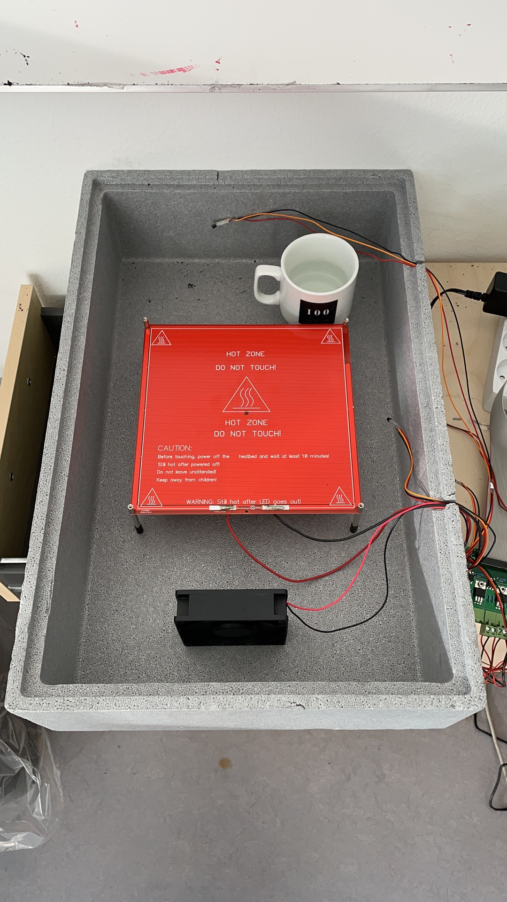
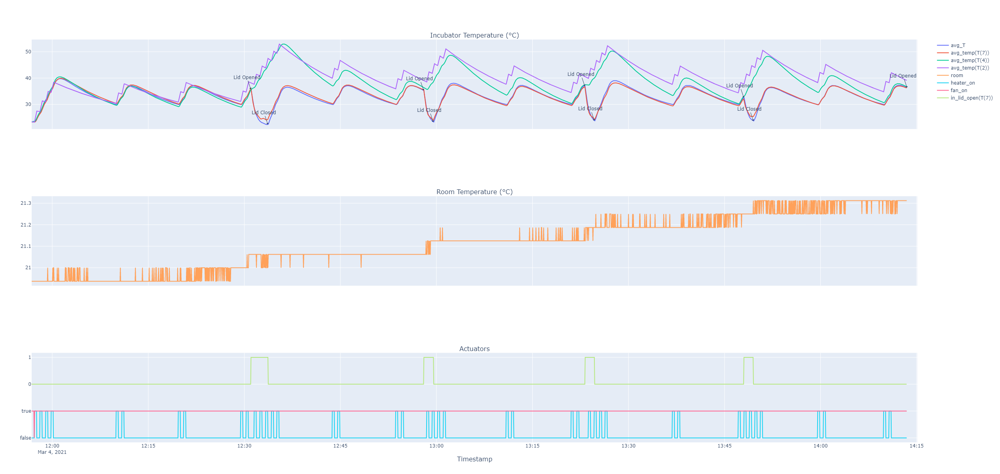

# Experiment with different control parameters

## Goal 

Illustrate the effect of opening the lid and adding water, and testing the 7 parameter model.

## Author

Hao

## Configuration

### Hardware

Configuration without the water added:

Configuration with the water added:

### Software 

## Experiment Log and CSVs

- [lid_opening_experiment_mar_2021.csv](lid_opening_experiment_mar_2021.csv): the dataset
- [events.csv](events.csv): Contains the event log that can be plotted.

Experiment conducted by Hao Feng on 4th March 2021 (time zone: UTC+1).
Log:
- 13:31:00 open
- 13:33:40 close
- 13:58:00 open
- 13:59:30 closed
- 14:23:10 open
- 14:24:40 closed
- 14:48:00 open
- 14:49:30 close
- 15:13:30 open and added a cup of water
- 15:15:00 closed
- 15:38:30 open (with the water)
- 15:40:00 close
- 16:51:00 open and take out the water
- 16:52:30 closed 

## Results and Discussion

This dataset was used for the calibration of the SevenParameterIncubatorPlant model.
The calibration itself is still a work in progress, as we probably need to have a more controlled experiment, using possibly a sensor embedded in the object inside the incubator.

But the dataset was good enough to show how the SevenParameterIncubatorPlant nicely incorporates the open lid dynamics.

Open the [interactive plot](./results.html)

