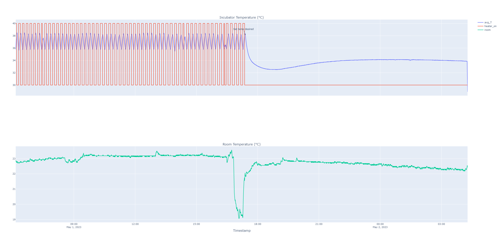

# Experiment 

## Goal 

Incubator a batch of tempeh. 
Started with 325g soaked beans, and followed recipe in:
- Steinkraus, K. H., Y. B. Hwa, J. P. Van Buren, M. I. Provvidenti, and D. B. Hand. “Studies on Tempeh. An Indonesian Fermented Soybean Food.” Food Research 25 (1960): 777–88.

## Author

Claudio Gomes

## Configuration

### Hardware

The current configuration as of the time of commit is used.

### Software 

The controller configuration was:
```
controller: {
    temperature_desired = 38.0,
    lower_bound = 2.0,
    heating_time = 60000.0, # Practically infinite
    heating_gap = 5.0
}
```

After the fungus starts to grow, I manually set the `temperature_desired` to 30 degrees, effectively shutting down the controller.

## Experiment Log and CSVs
- [rec_2023-05-01__08_09_06.csv](rec_2023-05-01__08_09_06.csv): the dataset. Some datapoints are missing due to internet connection drops.
- [events.csv](events.csv)

Log (CEST):
- 2023-05-01 08:07:40 - Place batch of tempeh
- 2023-05-01 19:23:50 - Change controller set temperature to 30.
- 2023-05-02 06:20:42 - Batch done. Looks good.

## Results and Discussion

Open the [interactive plot](./results.html)




