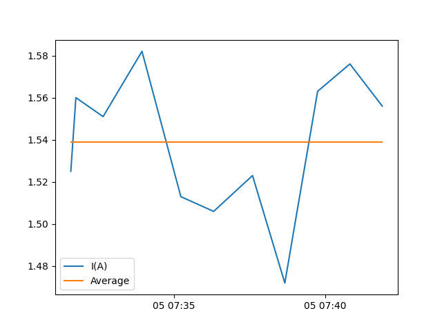

# Experiment 

## Goal 

Measure voltage and current.

## Author

Claudio Gomes

## Configuration

### Hardware

The current configuration as of the time of commit is used.

The voltage was measured under load (with the heater on) between the positive and negative poles of the power supply.

The current was measured in series under load.

### Software 

There is no software configuration. I just used turned the heater and fan on.

## Experiment Log and CSVs

The heater was turned on for about 10 minutes, and the voltage was measure at the beginning, after 5 minutes, and at the end.

The same procedure was carried out for the current measurements, except measurements were taken about 1 minute apart.

- [currents.csv](currents.csv): contains the current measurements. Timestamp is nanoseconds, and current in Amps.

## Results and Discussion

The voltage measured was consistently 12.16V

The current was a bit more noisy, as can be seen:

The average is: 1.54 A

