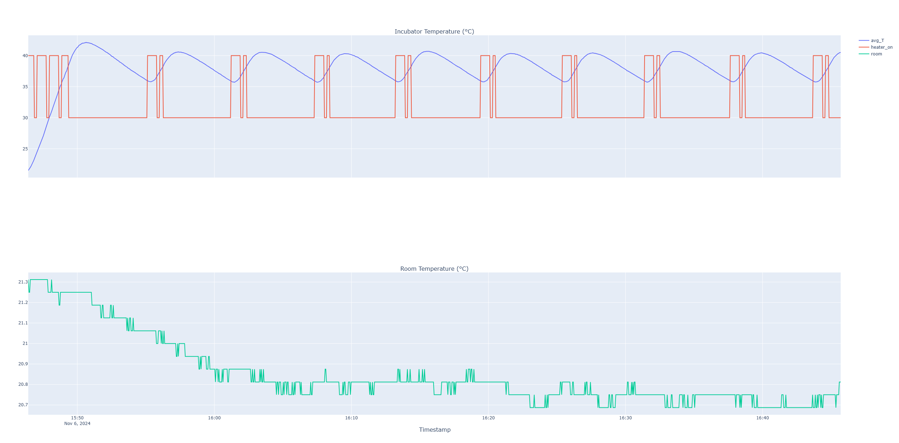

# Experiment 

## Goal 

Calibration of plant models with an empty system. Closed lid.

## Author

Claudio Gomes

## Configuration

### Hardware

The current configuration as of the time of commit is used.

### Software 

The controller configuration was:
```
controller: {
    temperature_desired = 38.0,
    lower_bound = 2.0,
    heating_time = 40.0,
    heating_gap = 10.0
}
```

## Experiment Log and CSVs
- [20241106_calibration_empty_system.csv](20241106_calibration_empty_system.csv): the dataset.

## Results and Discussion

Open the [interactive plot](./results.html)




